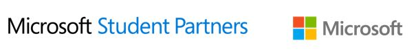
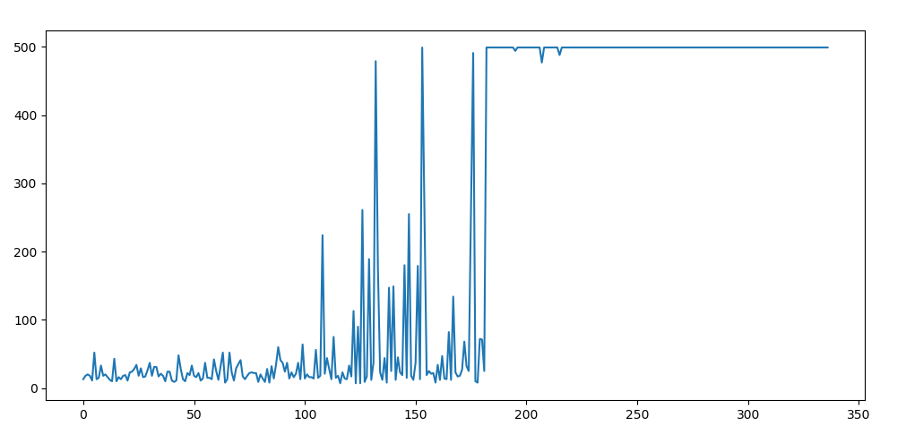
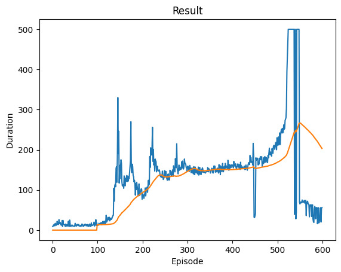

### 2019 Microsoft Student Partners (MSP) Evangelism Seminar

**처음 시작하는 강화학습 with OpenAI Gym**

**2019. 03. 31**

---

**Cart Pole 균형 문제는 유전자 알고리즘, 인공신경망, 강화학습 등을 이용한 제어 전략 분야의 표준 문제이다.**

### Result (legacy)

 

### Last Updated (2024. 01.)

> <https://pytorch.org/tutorials/intermediate/reinforcement_q_learning.html>

- python 3.9.11

This tutorial shows how to use PyTorch to train a Deep Q Learning (DQN) agent on the CartPole-v1 task from Gymnasium.

**Diagram**

Actions are chosen either randomly or based on a policy, getting the next step sample from the gym environment. We record the results in the replay memory and also run optimization step on every iteration. Optimization picks a random batch from the replay memory to do training of the new policy. The “older” target_net is also used in optimization to compute the expected Q values. A soft update of its weights are performed at every step.
