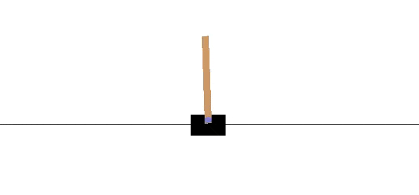
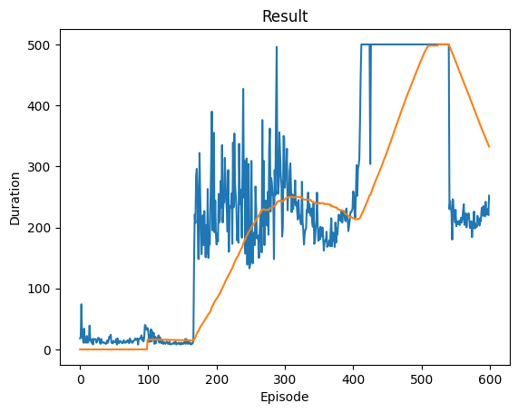
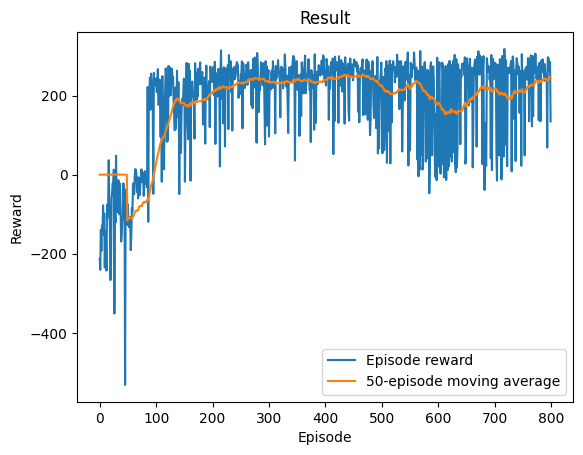
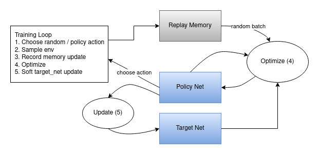

# reinforcement-learning-dqn-gymnasium

Compact, educational PyTorch implementations of DQN for classic control and Box2D tasks in Gymnasium.

## Environments

| Environment | Notebook | Episodes | Notable difference |
| --- | --- | --- | --- |
| CartPole-v1 | [01_cartpole.ipynb](./01_cartpole.ipynb) | 600 | Baseline |
| LunarLander-v2 | [02_lunar_lander.ipynb](./02_lunar_lander.ipynb) | 800 | Larger network, slower ε-decay |

### CartPole-v1





### LunarLander-v2



## DQN Architecture



At each step, the agent selects an action with epsilon-greedy exploration, stores the transition in replay memory, samples random mini-batches, and minimizes temporal-difference loss. The target network is updated with a soft update rule to stabilize learning.

## Requirements

- Python 3.11+
- torch==2.2.2
- gymnasium[box2d]==0.29.1
- matplotlib==3.9.2

Install dependencies:

```bash
pip install -r requirements.txt
```

## Notes

- `archive/` contains older seminar-era materials kept for reference.
- The implementations are adapted from the PyTorch DQN tutorial style and simplified for notebook learning.
